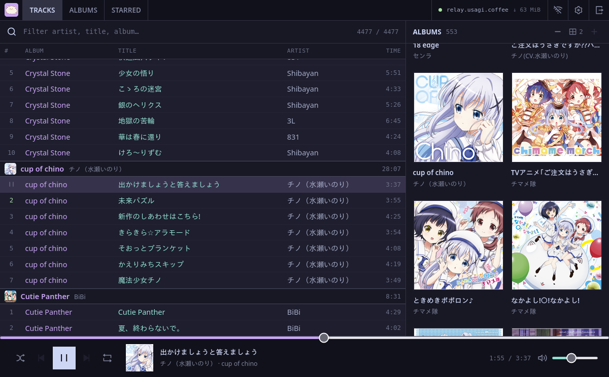

# iroh-fm - unstoppable music server


**Ever wanted to share your music library with your friends?** With `iroh-fm`, it is as easy as sending them a URL. They open the link and your library is ready to play. No account, native app, public IP address, port forwarding, or permission from your firewall or NAT is required.

The real music server runs on your own bare metal at home, and nothing stops it. You do not need to expose ports, obtain a public IP address, configure a reverse proxy, or move your library into somebody else's cloud. When a direct path is unavailable, iroh can carry the end-to-end encrypted connection through a relay over TCP port 443. That means `iroh-fm` can work from many restrictive or firewalled networks that block inbound traffic, UDP, and almost everything except ordinary web traffic.

The host does not need to be a traditional server. Run `iroh-fm` on a desktop, laptop, NAS, home server, or even an Android phone, then listen from anywhere using any modern browser. It is your unstoppable personal music server with a private, end-to-end encrypted connection.

## [Open the web player](https://usagi-coffee.github.io/iroh-fm/)

Start the server, copy its [iroh](https://iroh.computer/) endpoint ticket, and share it with the people you trust. The same ticket works from a phone, tablet, laptop, or desktop wherever they can open the web player.

**The website is fully static.** It is only HTML, CSS, JavaScript, and WebAssembly hosted on GitHub Pages. There is no application backend, no SSR, and no server-side code behind the website. The browser connects directly to the `iroh-fm` server running on your or your friend's device.



## Why “unstoppable”?

- **Run it on your own bare metal:** keep the server and music library on hardware you control at home.
- **NAT cannot stop it:** the endpoint ticket carries the information needed to reach the server without port forwarding, a public IP address, or a public HTTP endpoint.
- **Gets through restrictive networks:** if direct networking is blocked, iroh can fall back to its relay path over TCP port 443, a port most networks already permit for HTTPS traffic.
- **Host it almost anywhere:** use a desktop, laptop, NAS, home server, VPS, Android phone, or any other device that can run the `iroh-fm` binary and read your music directory.
- **Use any modern device:** open the static web player on a phone, tablet, laptop, or desktop - there is no native client to install.
- **No application middleman:** the browser talks to your iroh endpoint, not to a hosted iroh-fm API service.
- **End-to-end encrypted:** browser connections travel through an iroh relay because browsers cannot open UDP sockets, but the relay only forwards encrypted traffic and cannot read your music.
- **Portable client:** the web player is just static files and can be hosted on GitHub Pages, another static host, or locally.
- **Stable identity and access control:** optionally give clients a persistent secret and allowlist their endpoint IDs on the server.

## Quick start

Install the server:

```fish
cargo install --git https://github.com/usagi-coffee/iroh-fm server
```

Point it at your music library:

```fish
iroh-fm --music-dir /path/to/music
```

The server scans and indexes the library, watches it for changes, and prints an iroh endpoint ticket. Open the [iroh-fm web player](https://usagi-coffee.github.io/iroh-fm/), paste the ticket, and connect.

To prepare a link that opens the library directly, place the server ticket in the URL fragment:

```fish
https://usagi-coffee.github.io/iroh-fm/#ticket=SERVER_TICKET
```

If the server allowlists a specific client identity, include that client's secret as well:

```fish
https://usagi-coffee.github.io/iroh-fm/#ticket=SERVER_TICKET&secret=CLIENT_SECRET
```

URL-encode the ticket and secret if they contain reserved URL characters. Everything after `#` stays inside the recipient's browser and is never included in the request sent to GitHub Pages or another static host. Anyone who receives a link containing a client secret can use that identity, so only send it to people you trust.

For a stable server identity, a custom relay, or a client allowlist:

```fish
iroh-fm \
  --music-dir /path/to/music \
  --secret your-server-secret \
  --relay https://relay.example.com \
  --peer allowed-client-endpoint-id
```

`--peer` is repeatable. Leave it out to accept any client that has the server ticket. The web player can generate and retain its own client secret; its endpoint ID is available in Settings for allowlisting.

## Web player

The first-party player is a client-rendered Svelte SPA with no SSR and no HTTP application backend. It includes:

- a virtualized song list and album browser
- progressive playback with next-track prefetching
- persistent Cache Storage for songs and covers
- an offline-only media mode
- per-identity or custom-key starred collections
- shareable ticket links that keep credentials in the URL fragment
- installable PWA support
- responsive desktop and mobile layouts

Browser iroh connections are currently relay-only. Their HTTPS-compatible relay transport uses TCP port 443, allowing the player to work across many networks that block unusual protocols or ports. The server ticket must contain a reachable relay, or you can configure relay addresses in the advanced connection editor.

To run the web player locally:

```fish
rustup target add wasm32-unknown-unknown
cargo install wasm-bindgen-cli --version 0.2.125 --locked
bun install
bun run dev
```

See [`packages/web/README.md`](packages/web/README.md) for static builds and GitHub Pages deployment.

## Existing players through Subsonic

The first-party iroh web client is the main way to use `iroh-fm`. Subsonic compatibility is available as a secondary adapter for existing players such as **Tauon**, **Strawberry**, and other Subsonic-compatible clients.

Install and run the adapter:

```fish
cargo install --git https://github.com/usagi-coffee/iroh-fm subsonic

iroh-fm-subsonic \
  --ticket your-iroh-fm-server-ticket \
  --bind 127.0.0.1:4040 \
  --username admin \
  --password admin
```

Then add `http://127.0.0.1:4040` as a Subsonic server in your player with the configured username and password. The adapter translates Subsonic HTTP requests into calls to the remote iroh music server and bridges audio back to the player.

The Subsonic service is only a compatibility facade. It does not own the library index or its semantics, and the core server contains no Subsonic route or authentication logic.

Additional adapter options:

```text
--endpoint <ID>       connect using an endpoint ID instead of a ticket
--relay <URL>         provide or override the backend relay
--secret <SECRET>     use a stable identity for the adapter
--bind <ADDRESS>      HTTP listen address; defaults to 127.0.0.1:4040
```

Be careful when binding the Subsonic adapter beyond localhost: unlike the iroh transport, it exposes an HTTP service that you must secure appropriately.

## Android TWA

The Android app keeps the same Svelte interface as the PWA, but its transport and
player do not depend on JavaScript remaining alive. A native Rust iroh client can
negotiate a direct peer-to-peer path to the music server when one is available,
falling back to the configured relay when it is not.

Playback runs in an Android Media3 foreground service. The current track keeps
playing with the screen off or while the TWA is suspended, and the service can
download and advance through the queue without waking the web page. When the app
is opened again, the TWA bridge synchronizes the native queue, current track,
playback position, download progress, and controls back into the Svelte UI.

See [`android/README.md`](android/README.md) for build, signing, and Digital Asset Links setup.

## Workspace

```text
crates/
  client/       native iroh RPC client
  protocol/     shared backend request and response types
  server/       music scanner, index, and iroh server
  subsonic/     optional Subsonic compatibility facade
  web-wasm/     browser wasm-bindgen bridge
packages/
  client/       reusable JavaScript/WASM browser client
  web/          fully static Svelte/Tailwind player
android/        TWA shell and Media3 foreground playback service
```

The architecture deliberately keeps the music library and iroh operations protocol-agnostic. Subsonic and any future compatibility service remain sibling adapters rather than becoming the source of truth.

## Credits

- **[iroh](https://iroh.computer/)** provides the peer-to-peer networking, endpoint tickets, relays, and end-to-end encrypted transport that make `iroh-fm` possible.
- The interface uses the **[Catppuccin](https://catppuccin.com/) Mocha** palette.
- The library layout and player experience are inspired by **[Tauon Music Box](https://tauonmusicbox.rocks/)**.
